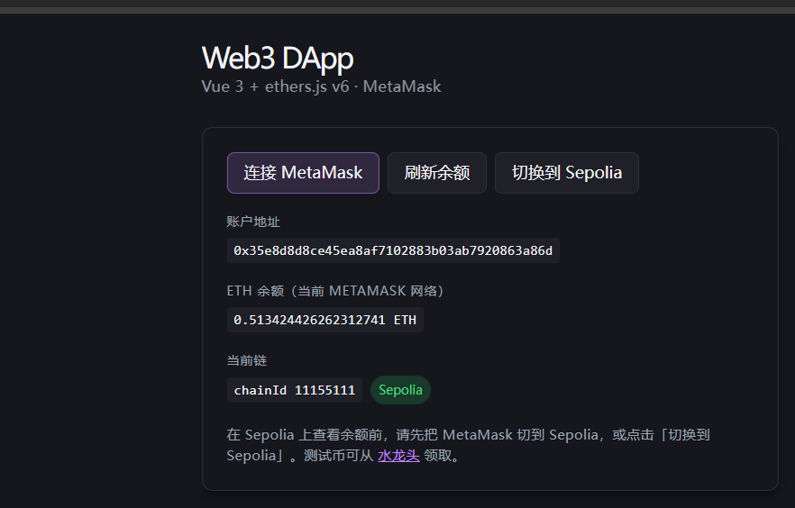
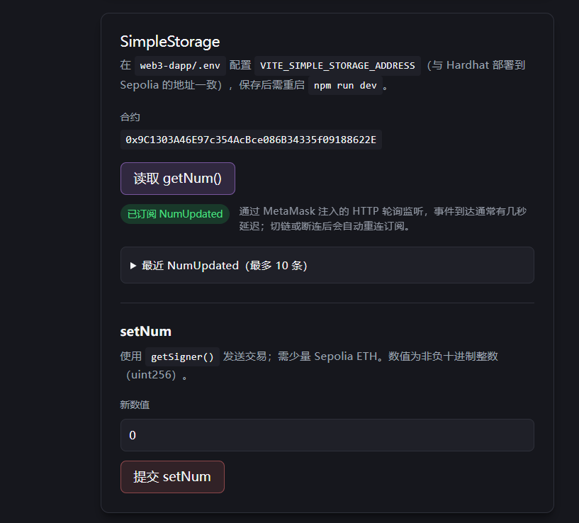
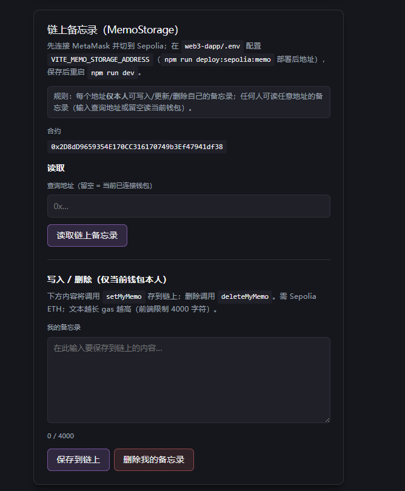
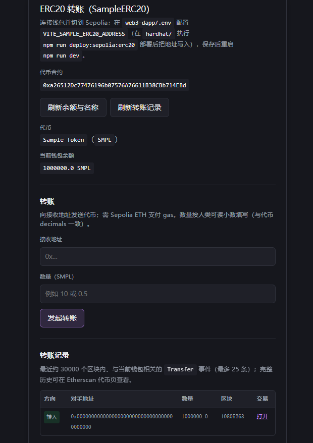
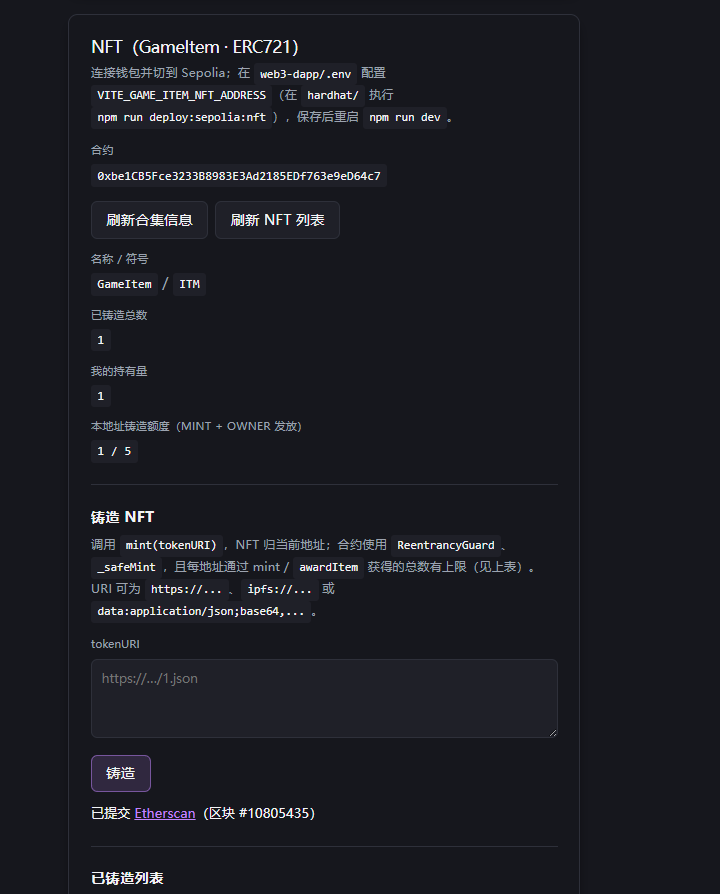
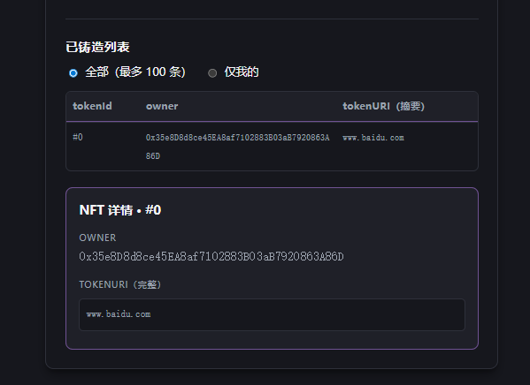
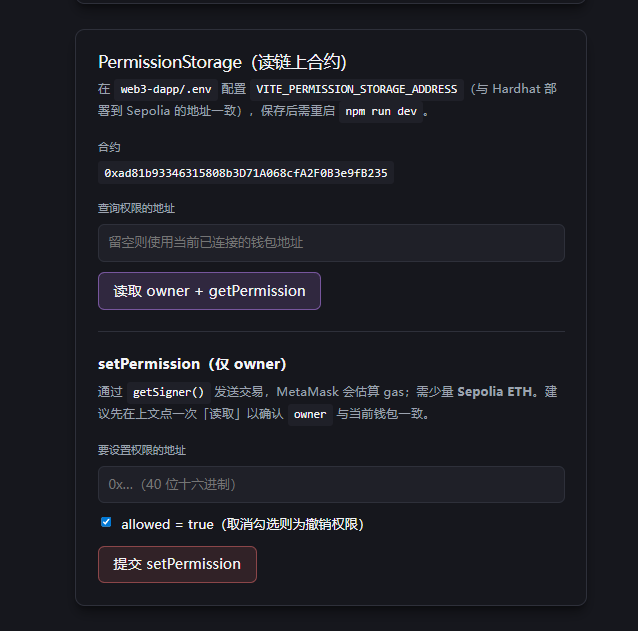

# Hardhat 智能合约工程

本目录为 **Hardhat 2.x + Solidity 0.8.30** 合约工程，与前端仓库分离部署。前端示例见：<https://github.com/wanghaikui274973875/web3-dapp>（本地联调时可在同级目录放置 `web3-dapp`）。

---

## 环境要求

| 项 | 说明 |
|----|------|
| Node.js | 建议 **18+** |
| 网络 | 本地 **Hardhat** 默认链；测试网 **Sepolia**（见 `hardhat.config.ts`） |
| 依赖 | `npm install` 安装 `@nomicfoundation/hardhat-toolbox`、`@openzeppelin/contracts` 等 |

---

## 环境变量（`.env`）

1. 复制 **`hardhat/.env.example`** 为 **`hardhat/.env`**，按示例填写变量。
2. 部署到 **Sepolia** 时至少需要：

| 变量 | 用途 |
|------|------|
| `SEPOLIA_RPC_URL` | Sepolia JSON-RPC 端点（如 Infura、Alchemy、公共节点等） |
| `SEPOLIA_PRIVATE_KEY` | 部署钱包私钥，**不要提交到 Git**；可带或不带 `0x` 前缀 |

部分脚本还会读取：

| 变量 | 用途 |
|------|------|
| `SEPOLIA_PERMISSION_TEST_ADDRESS` | `deployPermissionStorageSepolia` 中用于链上校验 `setPermission` 的目标地址（可选，缺省为部署者地址） |

---

## 目录结构（与本 README 相关）

```
hardhat/
├── contracts/           # Solidity 源码
│   ├── security/        # 安全演示：重入漏洞与修复
│   └── …                # 业务示例合约
├── scripts/             # Hardhat 部署与工具脚本
├── test/                # Mocha + Chai + ethers（TypeChain 类型）
├── typechain-types/     # `npm run build` 后生成的 TS 类型（勿手改）
├── hardhat.config.ts    # 编译器版本、Sepolia 网络、路径
└── README.md            # 本文件
```

---

## 常用命令速查

```bash
cd hardhat

# 安装依赖
npm install

# 编译合约并生成 TypeChain 类型
npm run build

# 清理 artifacts 与 cache
npm run clean

# 运行全部测试
npm test

# 仅运行重入演示测试（教学用）
npx hardhat test test/Reentrancy.ts

# 本地 Hardhat 网络执行 deploy.ts
npm run deploy:local
```

---

## npm scripts 说明

| 命令 | 作用 |
|------|------|
| `npm run build` | 等价 `hardhat compile`，生成 `artifacts/` 与 `typechain-types/` |
| `npm run clean` | 等价 `hardhat clean` |
| `npm test` | 运行 `test/` 下所有 `*.ts` 测试 |
| `npm run deploy:local` | `hardhat run scripts/deploy.ts --network hardhat` |
| `npm run deploy:sepolia:permission` | 部署 `PermissionStorage` 并做链上读写校验 |
| `npm run deploy:sepolia:simple` | 部署 `SimpleStorage` 并校验 `setNum` / `getNum` |
| `npm run deploy:sepolia:memo` | 部署 `MemoStorage` 并校验 |
| `npm run deploy:sepolia:erc20` | 部署 `SampleERC20`（名称/符号/小数/总量见脚本内参数） |
| `npm run deploy:sepolia:nft` | 部署 `GameItem`（ERC721） |
| `npm run deploy:sepolia:english-auction` | 部署 `EnglishAuctionHouse`（英式拍卖） |

英式拍卖完整部署、测试与 Sepolia 联调步骤见 **[docs/ENGLISH_AUCTION.md](docs/ENGLISH_AUCTION.md)**。

所有 `deploy:sepolia:*` 均需在 **`hardhat/`** 目录、已配置 `.env` 的前提下执行，且 `--network sepolia` 已写在脚本调用中。

---

## 合约一览

### 业务与示例

| 合约文件 | 合约名 | 简要说明 |
|----------|--------|----------|
| [contracts/SimpleStorage.sol](contracts/SimpleStorage.sol) | `SimpleStorage` | 单槽 `uint256`；`setNum` **无访问控制**（教学用有意设计，见合约注释） |
| [contracts/PermissionStorage.sol](contracts/PermissionStorage.sol) | `PermissionStorage` | 地址授权 mapping；**仅 owner** 可 `setPermission` / `transferOwnership` |
| [contracts/MemoStorage.sol](contracts/MemoStorage.sol) | `MemoStorage` | 每地址独立字符串备忘录；仅本人可写/删，任意人可读 |
| [contracts/SampleERC20.sol](contracts/SampleERC20.sol) | `SampleERC20` | 标准 ERC20，构造参数传入 name/symbol/decimals/totalSupply |
| [contracts/ERC721URIStorage.sol](contracts/ERC721URIStorage.sol) | `GameItem` | ERC721 + URIStorage + Ownable；公开 `mint`（每地址上限）+ owner `awardItem`；含 `ReentrancyGuard` 与 `_safeMint`（见源码） |

### 安全演示（勿用于生产）

| 合约文件 | 说明 |
|----------|------|
| [contracts/security/VulnerableBank.sol](contracts/security/VulnerableBank.sol) | 故意「先外部 `call` 再改状态」的 ETH 银行，用于演示**重入** |
| [contracts/security/ReentrancyAttacker.sol](contracts/security/ReentrancyAttacker.sol) | 在 `receive` 中递归调用目标 `withdraw` 的攻击合约 |
| [contracts/security/SafeBank.sol](contracts/security/SafeBank.sol) | **CEI + OpenZeppelin `ReentrancyGuard`** 的修复示例 |

对应测试：[test/Reentrancy.ts](test/Reentrancy.ts)。

---

## 测试文件与覆盖范围

| 测试文件 | 覆盖合约 / 主题 |
|----------|-----------------|
| [test/PermissionStorage.ts](test/PermissionStorage.ts) | `PermissionStorage` |
| [test/MemoStorage.ts](test/MemoStorage.ts) | `MemoStorage` |
| [test/SampleERC20.ts](test/SampleERC20.ts) | `SampleERC20` |
| [test/GameItem.ts](test/GameItem.ts) | `GameItem` |
| [test/EnglishAuctionHouse.ts](test/EnglishAuctionHouse.ts) | `EnglishAuctionHouse`（Pull 退款/结算、多轮拍卖） |
| [test/Reentrancy.ts](test/Reentrancy.ts) | 脆弱银行可被抽干 + 安全银行攻击失败且受害者可提款 |

说明：`SimpleStorage` 当前**无**独立测试文件；可用 `npx hardhat console` 或自行在 `test/` 下补充用例。

运行单个测试文件示例：

```bash
npx hardhat test test/PermissionStorage.ts
npx hardhat test test/GameItem.ts
```

---

## Sepolia 部署与前端环境变量对照

部署成功后，将终端打印的合约地址写入 **`web3-dapp/.env`**（变量名以前端 `vite` 为准），并**重启** `npm run dev`。

| Hardhat 脚本 | 前端环境变量（示例） |
|----------------|----------------------|
| `deploy:sepolia:permission` | `VITE_PERMISSION_STORAGE_ADDRESS` |
| `deploy:sepolia:simple` | `VITE_SIMPLE_STORAGE_ADDRESS` |
| `deploy:sepolia:memo` | `VITE_MEMO_STORAGE_ADDRESS` |
| `deploy:sepolia:erc20` | `VITE_SAMPLE_ERC20_ADDRESS` |
| `deploy:sepolia:nft` | `VITE_GAME_ITEM_NFT_ADDRESS` |
| `deploy:sepolia:english-auction` | `VITE_ENGLISH_AUCTION_HOUSE_ADDRESS`（另需 NFT；ERC20 轮次还需 `VITE_SAMPLE_ERC20_ADDRESS`） |

英式拍卖部署与测试详见 **[docs/ENGLISH_AUCTION.md](docs/ENGLISH_AUCTION.md)**。

**注意**：合约逻辑或构造参数变更后必须**重新部署**并更新前端地址；旧地址与新版 ABI 可能不兼容。

---

## 前端联调演示截图（web3-dapp）

以下截图为 **[web3-dapp](../web3-dapp/)** 在 **Sepolia** 上连接 MetaMask 后的界面示意，用于对照「部署脚本 → 环境变量 → 页面功能」。原始 PNG 存放在本仓库 **[docs/dapp-screenshots/](docs/dapp-screenshots/)**（相对路径以 `hardhat/README.md` 所在目录为根）。更完整的前端说明见 [web3-dapp/README.md](../web3-dapp/README.md)。

### 1. 钱包与网络

连接 MetaMask、查看 **ETH 余额**、`chainId` 与 **Sepolia** 切换提示。



### 2. SimpleStorage

配置 `VITE_SIMPLE_STORAGE_ADDRESS` 后：**读取 getNum**、**NumUpdated** 订阅状态、**setNum** 写入。



### 3. MemoStorage（链上备忘录）

**读取**（可填查询地址）、**保存 / 删除** 本人备忘录；链上需 Sepolia ETH。



### 4. SampleERC20 转账

代币元数据与余额、**发起转账**、**Transfer** 事件列表（区块范围内最近若干条）。



### 5. GameItem（ERC721）铸造

合集信息、**铸造额度**（每地址上限）、`mint(tokenURI)` 与交易确认链接。



### 6. GameItem 列表与详情

已铸造列表（全部 / 仅我的）、**tokenId / owner / tokenURI** 与详情区。



### 7. PermissionStorage

**读取 owner + getPermission**；**setPermission**（仅 owner 钱包可提交成功）。



---

## 其它脚本（非 Sepolia 一键部署）

| 文件 | 说明 |
|------|------|
| [scripts/deploy.ts](scripts/deploy.ts) | 本地 `hardhat` 网络使用的示例入口（由 `deploy:local` 调用） |
| [scripts/deploy_with_ethers.ts](scripts/deploy_with_ethers.ts) | 使用 ethers 的示例部署脚本 |
| [scripts/deploy_with_web3.ts](scripts/deploy_with_web3.ts) | 使用 web3 的示例部署脚本 |
| [scripts/ethers-lib.ts](scripts/ethers-lib.ts) / [scripts/web3-lib.ts](scripts/web3-lib.ts) | 库或辅助示例 |

---

## 编译与网络配置

- **Solidity**：`^0.8.30`，EVM 目标 **`cancun`**（见 [hardhat.config.ts](hardhat.config.ts)）。
- **Sepolia**：在 `hardhat.config.ts` 的 `networks.sepolia` 中配置 `url` 与 `accounts`（从 `SEPOLIA_PRIVATE_KEY` 读取）；RPC 超时可按需调大。
- **TypeChain**：编译后为 `ethers-v6` 生成类型，测试里可对 `getContractFactory` 返回值做 `as unknown as ContractType` 以消除宽泛类型。

---

## 安全与合规提示

- **私钥与 `.env`**：永远不要提交到版本库；CI 使用密钥托管或变量注入。
- **Sepolia ETH**：部署与链上校验需要测试 ETH，请从可信水龙头领取。
- **重入演示合约**：仅用于本地/教学理解，勿部署到主网或持有真实资产的环境。

---

## 延伸阅读

- Hardhat 文档：<https://hardhat.org/docs>
- OpenZeppelin 合约与安全：<https://docs.openzeppelin.com/contracts/>
- OpenZeppelin Learn（安全主题）：<https://docs.openzeppelin.com/learn/>

Node.js 建议 **18+**。
